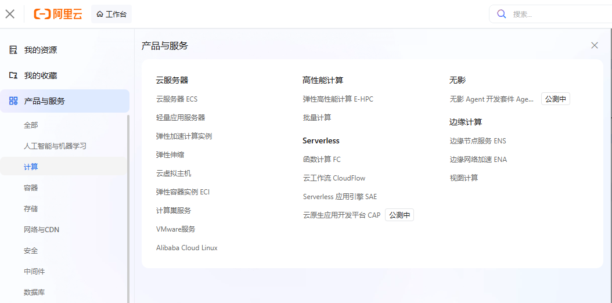
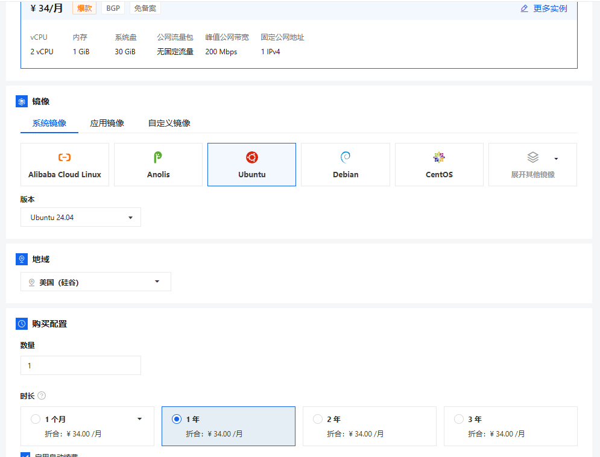
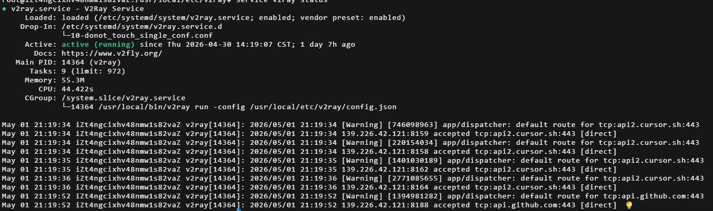
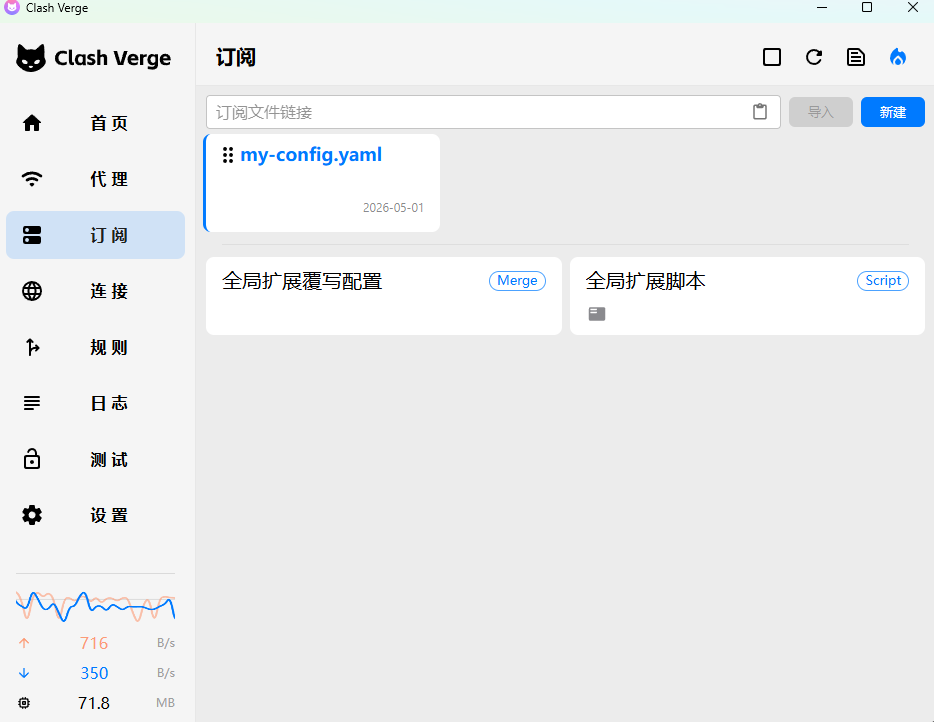
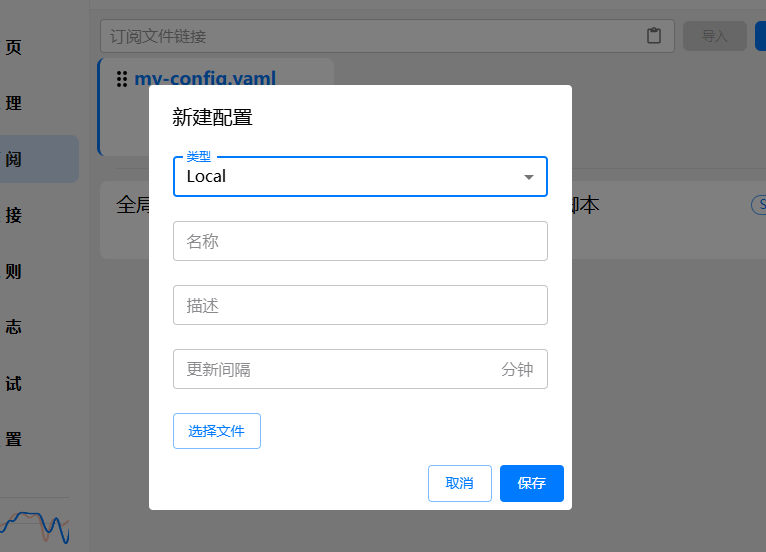

# 阿里云VPS + Clash Verge


## 购买阿里云VPS
登录阿里云，购买**轻量应用服务器**
中国区阿里云官网链接：https://home.console.aliyun.com/home/dashboard/ProductAndService

购买至少1GB内存的服务器，否则可能出现内存太小无法安装依赖的问题，大概34元/月。


系统镜像：任意选择，推荐ubuntu 22.03，太新的版本内核可能跟v2ray不兼容。
应用镜像：宝塔Linux面板，直接web页面访问os，比较方便。

## 自建节点

进入服务器的os，安装v2ray：
使用官方脚本，直接一键安装：

```shell
apt-get install -y curl
bash <(curl -L https://raw.githubusercontent.com/v2fly/fhs-install-v2ray/master/install-release.sh)
```

安装完成后，会自动生成配置文件模板：/usr/local/etc/v2ray/config.json，这个文件决定了v2ray的端口、uuid、协议以及netstream方式。
文件内容可以参考以下内容：
```json
{
    "log": {
        "loglevel": "warning"
    },
    "routing": {
        "domainStrategy": "AsIs",
        "rules": [
            {
                "type": "field",
                "ip": [
                    "geoip:private"
                ],
                "outboundTag": "block"
            }
        ]
    },
    "inbounds": [
        {
            "listen": "0.0.0.0",
            "port": 8282,        # 修改为没有被占用的ip
            "protocol": "vmess",
            "settings": {
                "clients": [
                    {
                        "id": "xxx"   # 一个uuid，可以用uuidgen工具直接生成，后面要用
                    }
                ]
            },
            "streamSettings": {
                "network": "tcp"      # 最基本的配置
            }
        }
    ],
    "outbounds": [
        {
            "protocol": "freedom",
            "tag": "direct"
        },
        {
            "protocol": "blackhole",
            "tag": "block"
        }
    ]
}
```

这个配置的streamSettings.network配置成tcp，是最基础的配置，如果要更安全，可以配置成httpupgrand或tls+ws等等，实践来看最基本的tcp也够用了。

安装完成并修改config.json以后启动v2ray服务即可（我使用的Ubuntu，centos应该是systemctl status v2ray）：
```shell
# 重启
service v2ray restart
# 查看运行状态
service v2ray status
```


## Clash Verge客户端配置
下载Clash Verge：https://github.com/clash-verge-rev/clash-verge-rev/tags
根据自己的os和架构选最新版本，安装Clash Verge即可。

进入设置，打开虚拟网卡和系统代理，注意记录端口设置，一般默认是7897。

准备config.yaml文件，我们使用一个最精简的Clash配置文件即可，内容如下：
``` yaml
port: 7897          # Clash的端口
socks-port: 7898    # Clash的端口+1，或者任意ip
allow-lan: true
mode: rule
log-level: info
external-controller: 127.0.0.1:9090

# 1. 节点信息
proxies:
  - name: "我的自建VMess"       # 名字任意
    type: vmess                # 如果是shadowsocks，则写ss
    server: 192.168.0.0        # 这是我们自建节点的ip
    port: 8282                 # 这是v2ray配置文件中指定的ip
    uuid: ""                   # 替换为自建节点的v2ray配置文件中的clients.id
    alterId: 0
    cipher: auto               # vmess可以使用auto，如果是ss，则必须配置好加密算法和密码。

# 配置模板可以参考：https://github.com/MetaCubeX/mihomo/blob/Meta/docs/config.yaml

# 2. 策略组
proxy-groups:
  - name: 节点选择
    type: select
    proxies:
      - "我的自建VMess"
      - DIRECT

# 3. 分流规则（核心：实现国内直连，国外代理）
rules:
  # 局域网流量直连
  - GEOIP,LAN,DIRECT
  # 常见的国内站点（如百度、阿里、腾讯等）自动识别直连
  - GEOIP,CN,DIRECT
  # 其他未匹配到的（通常是国外网站）走代理
  - MATCH,节点选择
```

在Clash Verge的订阅界面，新建订阅，类型选择local，把上面的yaml文件导入即可。



此时一个最基础的自建节点 + Clash Verge就搭建完成了。



